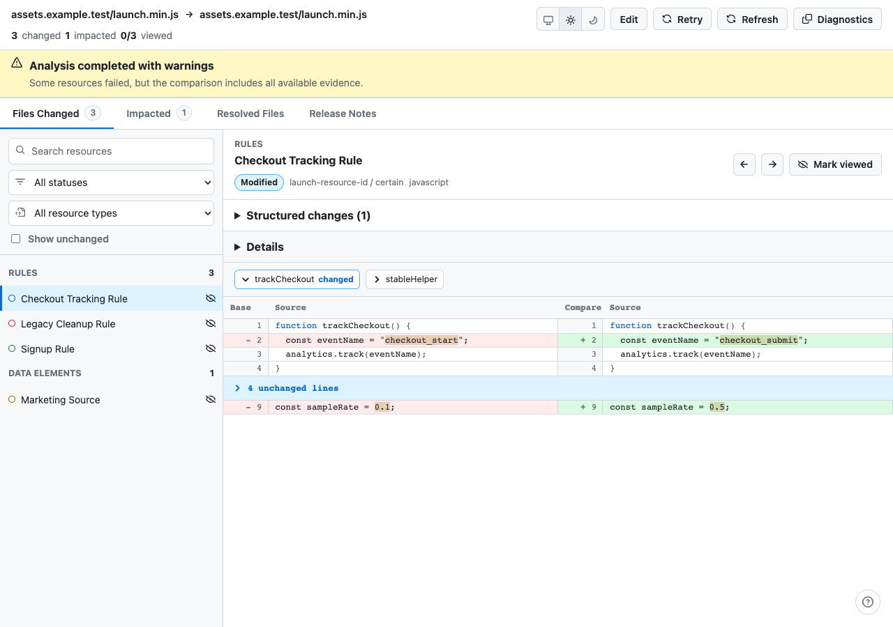

# LaunchDiff

LaunchDiff is an open-source, desktop-first web application for comparing two deployed Adobe Launch / Adobe Tags web libraries from the same property.

It reconstructs current-format Launch libraries from their public CDN URLs, recursively fetches only deferred Launch resources referenced by those builds, compares resources conservatively, displays changes using a GitHub-style split diff experience, traces downstream Data Element impact, and generates deterministic Markdown release notes.



## Core product principle

> When comparison certainty is insufficient, preserve and expose the potential difference. LaunchDiff may show an extra change, but it must never intentionally suppress a plausible deployed change merely to produce a cleaner diff.

## Features

- Direct URL and saved JSON config input modes.
- Secure public-resource fetch boundary with signed deferred-resource tokens.
- Static Launch parser for current-format deployed Adobe Tags libraries.
- Parser-confirmed deferred-resource resolution only; no arbitrary crawling.
- Conservative resource matching, normalization, dependency impact, and detailed diff generation.
- GitHub-style split diff workspace with syntax highlighting, line numbers, hunks, function folding, Viewed tracking, keyboard shortcuts, and light/dark themes.
- Resolved Files inventory, completeness warnings, and deterministic Markdown release notes.
- User-controlled sanitized diagnostics that exclude URLs, names, source, config, diffs, and release notes.

## Key constraints

- Current Adobe Launch / Adobe Tags web builds only.
- Base and Compare libraries must belong to the same Launch property when property identity can be determined.
- Public anonymous HTTP(S) library URLs only.
- No Adobe API integration or Adobe authentication.
- No user accounts, database, or server-side comparison history.
- No AI or LLM dependency.
- No execution of downloaded JavaScript.
- Recursive fetching is limited to parser-confirmed deferred Launch resources.
- Deployed artifacts are authoritative for change classification.
- GitHub Primer is the visual design-system foundation.
- Comparison workspace is desktop-only; landing page is responsive.

## Local Development

Requirements:

- Node.js 22 or newer.
- npm.
- Chrome for Playwright browser tests.

Install and run the full local validation suite:

```bash
npm ci
npm run verify
npm run test:e2e
npm run build
```

Run the app locally:

```bash
npm run dev
```

The comparison workspace is at `/compare`. The landing page is responsive; the comparison workspace intentionally requires at least `1024` CSS pixels.

## Configuration

LaunchDiff supports an optional JSON site configuration file for named environments. The repository includes:

- `examples/launchdiff.config.json`
- `examples/launchdiff.config.schema.json`

The config contains only names and public Launch library URLs. It is stored in `sessionStorage` for the active browser session only.

## Fixture Development

Automated tests must not depend on live Adobe CDN URLs.

- Keep sanitized public fixtures under `tests/fixtures/sanitized/`.
- Keep private/manual fixtures under `test-fixtures-private/`; that directory is gitignored.
- Parser changes need fixture-backed tests that prove the unsupported structure and preserve unknown/unmapped data.
- Never relax matching, normalization, or fixture expectations to make a diff look cleaner.

## Privacy And Security Principles

- Fetched JavaScript is data only and is never executed.
- Source, config, resource names, diffs, and release notes are not intentionally persisted or logged.
- Recursive fetches are limited to parser-confirmed deferred Launch resources.
- Canonical and deferred fetches are constrained to public HTTP(S) resources through SSRF checks, redirect revalidation, token scope, size limits, and retry policy.
- No accounts, database, AI API, behavioral telemetry, or automatic client-side error-reporting SaaS are required for v1.

See `PRIVACY.md` and `SECURITY.md` for the public policy language.

## Deployment

LaunchDiff is designed for a thin Vercel server boundary and browser Worker analysis.

Required production environment variable:

- `LAUNCHDIFF_TOKEN_SECRET`: high-entropy secret for signing short-lived analysis/fetch tokens.

Optional public environment variable:

- `NEXT_PUBLIC_GITHUB_REPOSITORY_URL`: repository URL used by the landing-page GitHub link.

See `docs/16-deployment.md` for production deployment notes.

## Contributing

Read `CONTRIBUTING.md` before opening a pull request. Parser, normalization, matching, and fetch-boundary changes require tests and must preserve the conservative change-detection principle.

## Documentation Map

- `AGENTS.md` — Codex operating rules and implementation guardrails.
- `docs/01-product-spec.md` — Product goals, workflows, requirements, and non-goals.
- `docs/02-architecture.md` — Browser, worker, analyzer, and Vercel architecture.
- `docs/03-domain-model.md` — Stable internal TypeScript contracts.
- `docs/04-analysis-semantics.md` — Parsing, matching, normalization, diff, and impact rules.
- `docs/05-fetch-security.md` — Deferred resource resolution, SSRF controls, tokens, retries, limits.
- `docs/06-ui-spec.md` — GitHub-fidelity comparison workspace requirements.
- `docs/07-landing-page.md` — GitHub-inspired LaunchDiff landing page and image prompts.
- `docs/08-release-notes.md` — Deterministic release-note generation rules.
- `docs/09-testing.md` — Fixture-first testing, visual regression, accessibility, E2E.
- `docs/10-implementation-plan.md` — Milestone-by-milestone Codex build sequence.
- `docs/11-acceptance-criteria.md` — v1 completion checklist.
- `docs/12-open-source-repo.md` — Repository, CI, privacy, security, and contribution structure.
- `examples/launchdiff.config.json` — Minimal example site configuration.
- `examples/launchdiff.config.schema.json` — Draft JSON Schema for site configuration.

## Runtime Environment

Set `LAUNCHDIFF_TOKEN_SECRET` for `/api/analysis/start` and `/api/fetch`. It is used to sign short-lived fetch-scope tokens for deferred resource requests and should be a high-entropy secret in every deployed environment.
